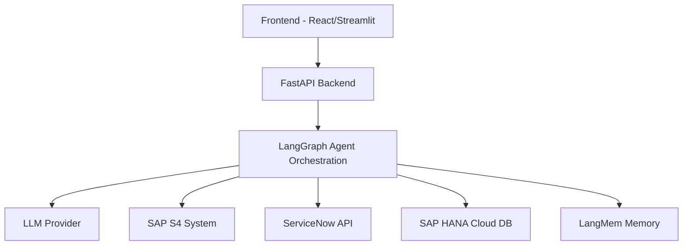
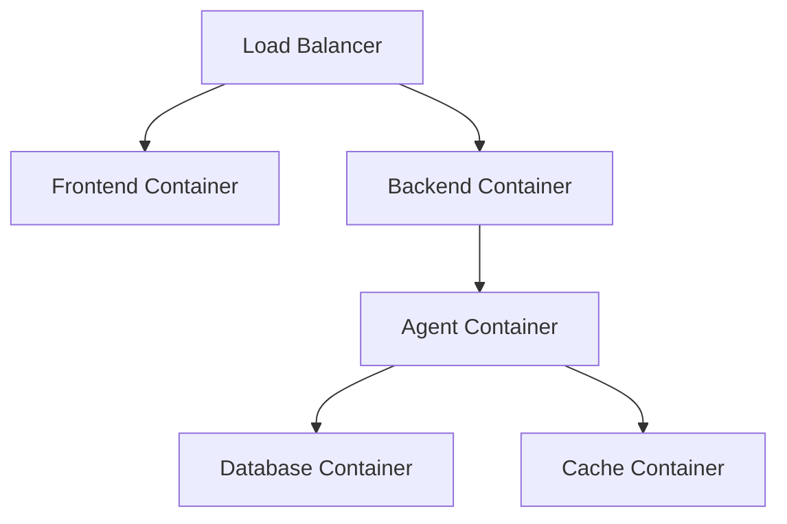

# Invoice Status Chatbot Architecture

## System Overview

## Component Details

### 1. Frontend Layer
- **React Application**
  - Modern UI with chat interface
  - Excel template download/upload functionality
  - Form validation and data collection
  - AG-UI protocol implementation
  - Responsive design for all devices

- **Streamlit Application**
  - Alternative UI for quick prototyping
  - Same functionality as React app
  - Simplified deployment

### 2. Backend Layer
- **FastAPI Application**
  - RESTful API endpoints
  - Type checking with Pydantic
  - OpenAPI documentation
  - Error handling middleware
  - Authentication/Authorization
  - Rate limiting

### 3. Agent Layer
- **LangGraph Orchestration**
  - Deterministic conversation flow
  - State management
  - Tool integration
  - Memory management
  - Error handling

### 4. External Systems Integration
- **SAP S4 System**
  - Invoice status queries
  - Data validation
  - Error handling

- **ServiceNow API**
  - Ticket creation
  - Status updates
  - Attachment handling

### 5. Data Layer
- **SAP HANA Cloud DB**
  - Long-term memory storage
  - Query history
  - User interactions
  - Performance metrics

- **LangMem**
  - Short-term memory
  - Conversation context
  - User session data

### 6. Monitoring & Evaluation
- **OpenTelemetry**
  - Distributed tracing
  - Performance monitoring
  - Error tracking

- **DeepEval**
  - LLM evaluation metrics
  - Response quality assessment
  - Model performance tracking

## Data Flow

1. User initiates conversation
2. Frontend captures input
3. Backend processes request
4. Agent orchestrates conversation flow
5. External systems provide data
6. Response generated and sent back
7. Memory updated
8. Metrics recorded

## Security Considerations

1. Authentication for internal/external users
2. Data encryption in transit
3. Secure API key management
4. Rate limiting
5. Input validation
6. Audit logging

## Deployment Architecture

## Monitoring & Logging

1. Application logs
2. Performance metrics
3. Error tracking
4. User analytics
5. System health checks 